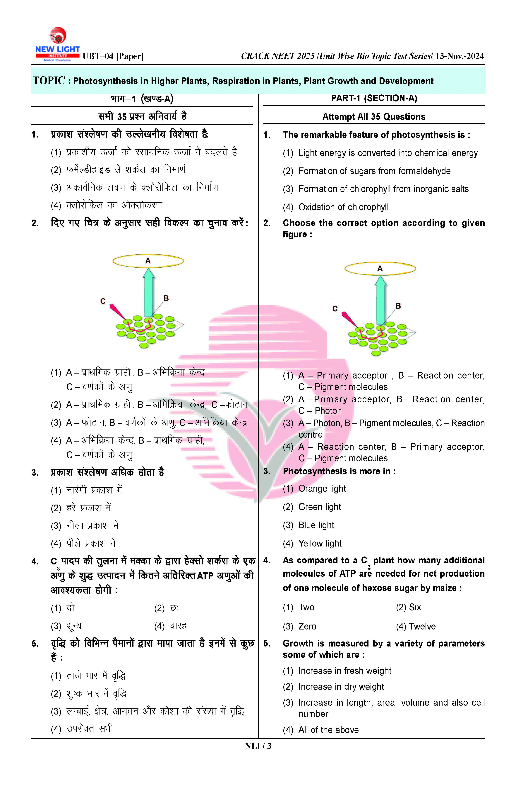
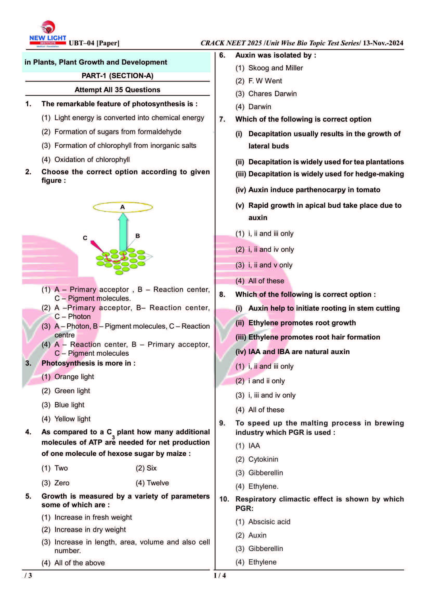

# PDF Cleanup Tool for New Light Institute's Test Paper

## Overview
This Python package processes a specific type of PDF file used in the NEET examination test paper series by New Light Institute. Each page is divided into two halves: Hindi questions on the left and English questions on the right. The script removes the Hindi section and replaces it with the next page's English section, effectively creating a clean, English-only version of the document.

## Features
- **Remove Hindi Section**: Automatically removes the Hindi section from each page.
- **Replace with English Questions**: Replaces the removed Hindi section with the English questions from the next page.
- **Customizable Margins**: Allows customization of top and side margins for precise cropping.
- **Delete Extra Pages**: Option to delete promotional or instruction pages from the start and end of the PDF.
- **Add Mark Sheet**: Adds a mark sheet image to the front page of the PDF.

## Prerequisites
Ensure you have the following dependencies installed:

```sh
pip install pillow pdf2image
```

Additionally, download and install [Poppler](https://github.com/oschwartz10612/poppler-windows/releases) for Windows users. Set the `poppler_path` accordingly in the script.
(Currently shipped with this repo)
## Installation
Clone the repository and navigate into the project folder:

```sh
git clone <repository_url>
cd pdf-overlapper
```

## Usage
1. Place your target PDF file in the project directory.
2. Rename the file like `UBT-04.pdf` and update `input_file_name` in the `main.py` file.
4. Run the script:

```sh
python main.py
```

The cleaned PDF will be generated with the name `<original_name>-Paper-Clean.pdf` in the same directory.

## Configuration
Modify the following variables in the script(`main.py`) for customization:

- `english_on_right`: Set `True` if English questions are on the right side.
- `delete_page_from_start`: Number of pages to remove from the beginning.
- `delete_page_from_end`: Number of pages to remove from the end.
- `top_margin` & `left_margin`: Adjust cropping values.

## Example Configuration

```python
# input your file name(with extension)
input_file_name = "UBT-04.pdf"

output_file_name = f"{input_file_name[:-4]}-Paper-Clean.pdf"

# generally left side of the paper is on `Hindi` and right side is on `English`
english_on_right = True  # True = right section of the page contains the English Questions

# no of page(s) to be deleted
delete_page_from_start = 1  # First page is always preserved. second page generally instruction
delete_page_from_end = 2  # if there are extra promotional pages
```

## Example
Original PDF:
```
Page 1: Hindi | English
Page 2: Hindi | English
```


After processing:
```
Page 1: English (from Page 1) | English (from Page 2)
Page 2: English (from Page 3) | English (from Page 4)
```


## Contributing

Contributions are welcome! Please open an issue or submit a pull request for any improvements or bug fixes.

## Acknowledgments

- **Pillow**: For image processing capabilities.
- **pdf2image**: For converting PDF pages to images.
- **Poppler**: For providing the necessary tools to handle PDF files.

## Support

If you have any questions or need further assistance, please open an issue on the GitHub repository.

## Fair Use Disclaimer

This tool is intended for educational and personal use only. It is designed to assist students in processing NEET 
examination test papers provided by New Light Institute. The authors of this tool do not claim ownership of the original 
content and do not endorse any unauthorized distribution of copyrighted material. Users are responsible for ensuring 
their usage complies with applicable copyright laws and institutional policies.
